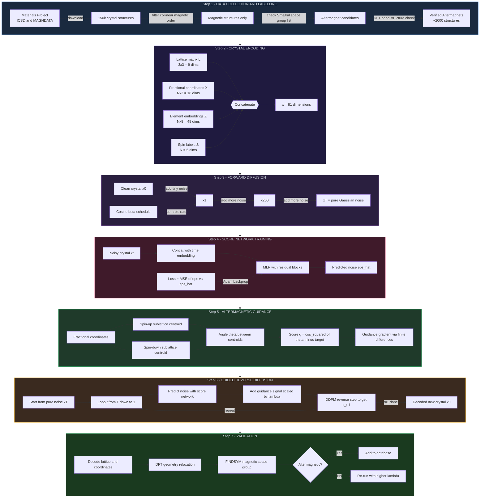
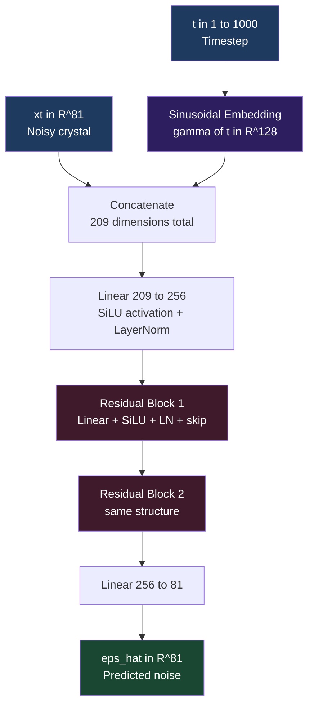
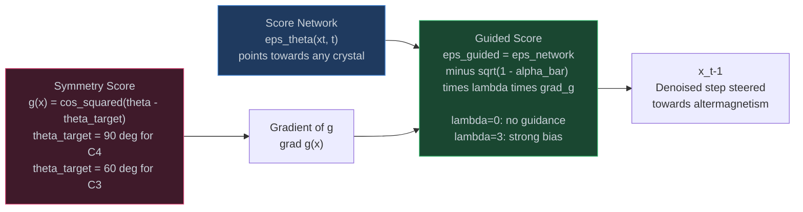

# Altermagnet Guided Diffusion – Complete Pipeline Workflow

Paste any block below into [mermaid.live](https://mermaid.live) to render it.

---

## Diagram 1 – Top-Level Pipeline Overview


---

## Diagram 2 – Detailed Step-by-Step Pipeline



---

## Diagram 3 – Forward vs Reverse Diffusion

```mermaid
flowchart LR
    subgraph FORWARD["FORWARD PROCESS - Destroys Structure (no learning needed)"]
        direction LR
        X0A[x0\nReal crystal] -->|add noise| X1A[x200\nslightly noisy]
        X1A -->|add noise| X2A[x500\nmoderately noisy]
        X2A -->|add noise| X3A[xT\npure Gaussian noise]
    end

    subgraph REVERSE["REVERSE PROCESS - Generates Structure (learned by score network)"]
        direction RL
        X4B[xT\npure noise] -->|denoise| X3B[x500]
        X3B -->|denoise + guidance| X2B[x200]
        X2B -->|denoise + guidance| X1B[x1]
        X1B -->|final step| X0B[x0 - New altermagnet!]
    end

    X3A -.->|same distribution| X4B

    style FORWARD fill:#1a2a4f,stroke:#4a90e2,color:#c9d1d9
    style REVERSE fill:#3f1a2a,stroke:#e24a7a,color:#c9d1d9
    style X0B fill:#1a4731,stroke:#27ae60,color:#fff
```



---

## Diagram 4 – Score Network Architecture



---

## Diagram 5 – Guidance Mechanism



---

## Diagram 6 – Training Loop

```mermaid
flowchart TD
    T1[Sample batch of crystals x0] --> T2[Sample random timestep t]
    T2 --> T3[Sample noise eps from N(0,I)]
    T3 --> T4[Make noisy crystal\nxt = sqrt(alpha_bar_t) times x0\nplus sqrt(1 minus alpha_bar_t) times eps]
    T4 --> T5[Forward pass through network\neps_hat = score_network(xt, t)]
    T5 --> T6[Loss = mean squared error\nof eps minus eps_hat]
    T6 --> T7[Adam update network weights]
    T7 -->|next batch| T1

    style T4 fill:#2a1f3f,stroke:#b06ae2,color:#c9d1d9
    style T5 fill:#3f1a2a,stroke:#e24a7a,color:#c9d1d9
    style T6 fill:#1f3a1a,stroke:#27ae60,color:#c9d1d9
```
